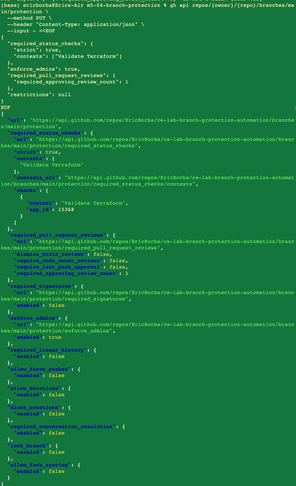
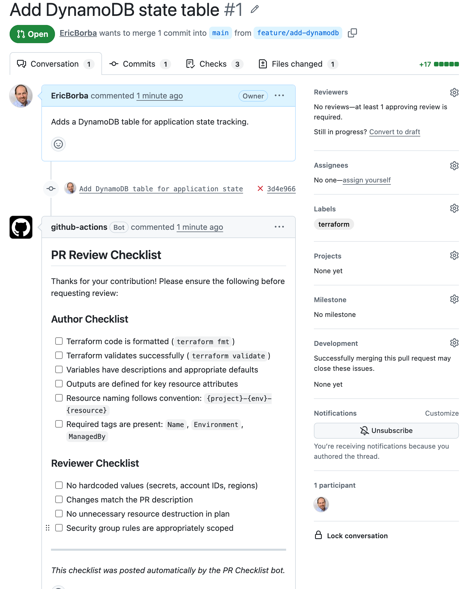
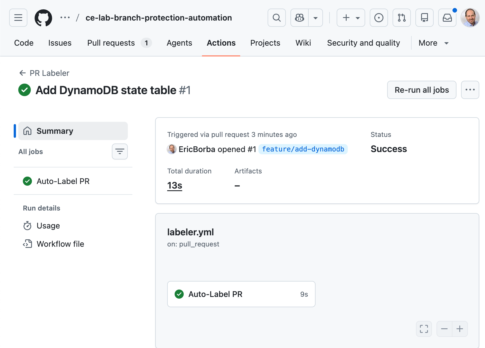
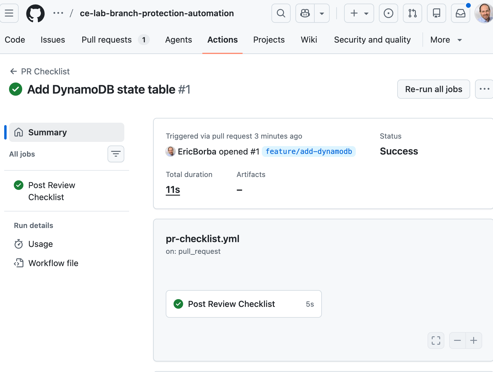
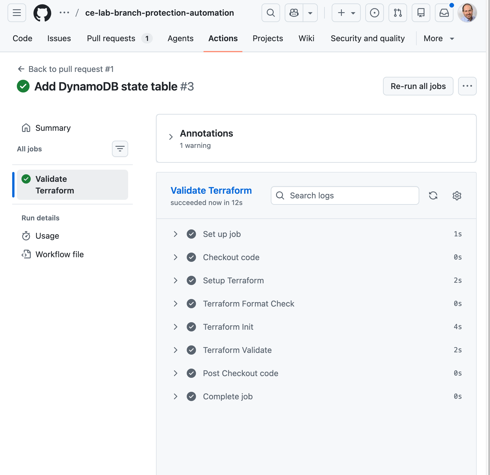
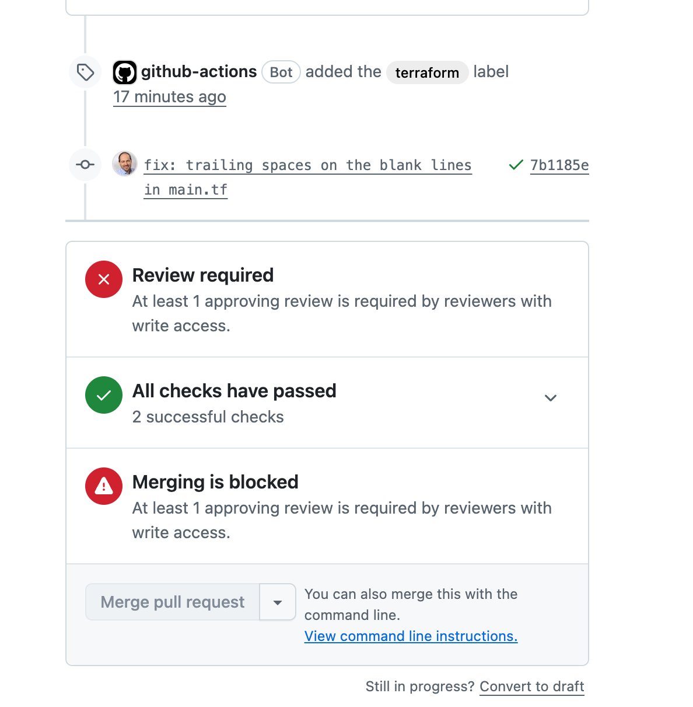
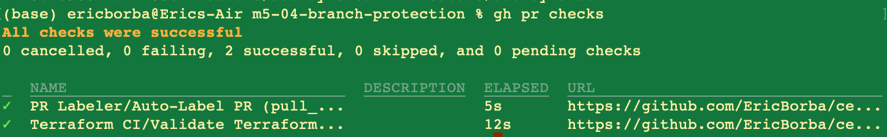
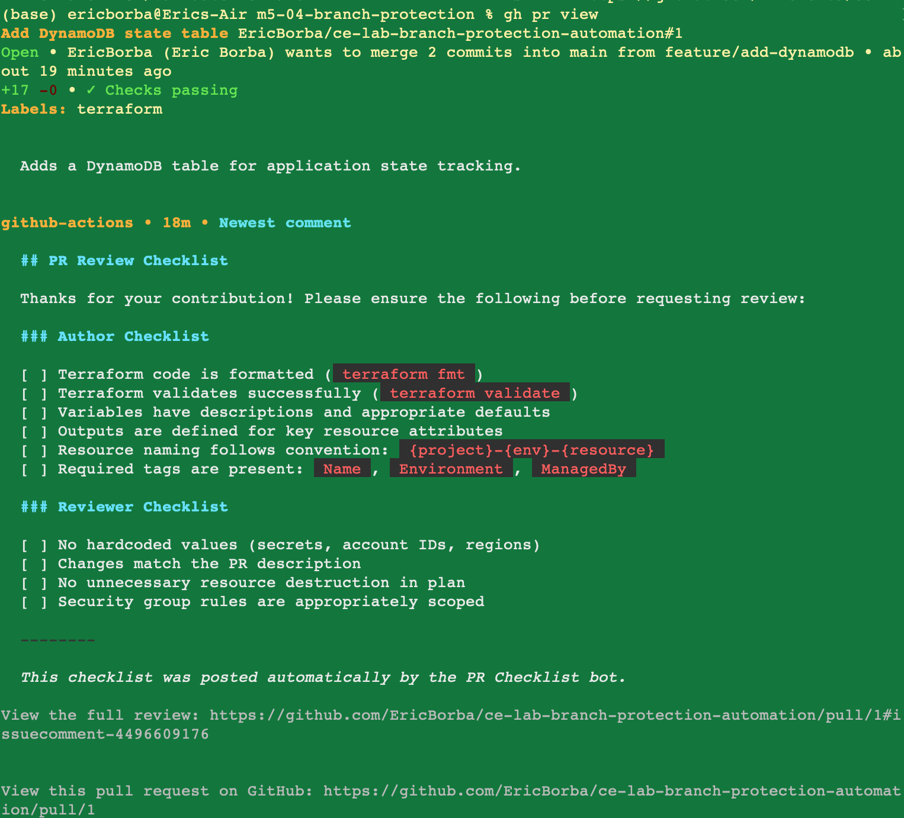

# Lab: Branch Protection & PR Automation

## Overview

This lab demonstrates how to enforce safe collaboration practices on a GitHub repository by configuring branch protection rules and automating pull request workflows. The project contains Terraform code that provisions AWS infrastructure (an S3 bucket and a DynamoDB table), and the repository is set up so that no change can reach `main` without passing automated CI checks and receiving a code review.

## What Was Built

### Infrastructure (Terraform)

| Resource | Name Pattern | Purpose |
|---|---|---|
| `aws_s3_bucket` | `{project}-{env}-assets` | Stores application assets with versioning enabled |
| `aws_dynamodb_table` | `{project}-{env}-state` | Tracks application state with `LockID` as partition key |

### GitHub Automation

| File | Purpose |
|---|---|
| `.github/CODEOWNERS` | Assigns `@EricBorba` as required reviewer for all files, Terraform files, workflows, and docs |
| `.github/labeler.yml` | Auto-labels PRs based on which files changed (`terraform`, `docs`, `ci`, `config`) |
| `.github/workflows/ci.yml` | Runs `terraform fmt`, `terraform init`, and `terraform validate` on every PR targeting `main` |
| `.github/workflows/labeler.yml` | Executes the labeler on every PR event |
| `.github/workflows/pr-checklist.yml` | Posts an author/reviewer checklist comment when a PR is opened |

## Branch Protection Rules Applied

Branch protection was configured on `main` using the GitHub CLI (`gh api`):

- **Required status checks** — the `Validate Terraform` CI job must pass before any merge is allowed
- **Strict status checks** — the branch must be up to date with `main` before merging
- **Required pull request reviews** — at least **1 approving review** from a code owner is required
- **Enforce admins** — the rules apply to repository administrators as well

```bash
gh api repos/{owner}/{repo}/branches/main/protection \
  --method PUT \
  --header "Content-Type: application/json" \
  --input - <<EOF
{
  "required_status_checks": {
    "strict": true,
    "contexts": ["Validate Terraform"]
  },
  "enforce_admins": true,
  "required_pull_request_reviews": {
    "required_approving_review_count": 1
  },
  "restrictions": null
}
EOF
```



## PR Workflow Walkthrough

A feature branch `feature/add-dynamodb` was created to add the DynamoDB table resource to `main.tf`. A pull request was opened, which triggered the full automated workflow.

### Step 1 — Auto-label and checklist are posted automatically

When the PR was opened, two workflows fired in parallel:

- The **PR Labeler** detected changes to `*.tf` files and added the `terraform` label automatically.
- The **PR Checklist** bot posted a structured author and reviewer checklist as a PR comment.







### Step 2 — Terraform CI validates the code

The `ci.yml` workflow ran `terraform fmt -check`, `terraform init -backend=false`, and `terraform validate`. All steps passed successfully.



### Step 3 — Branch protection blocks the merge

Even though all CI checks passed, the branch protection rules prevented the merge because no approving review had been submitted yet. GitHub displayed:

- **Review required** — at least 1 approving review is required by reviewers with write access
- **All checks have passed** — 2 successful checks
- **Merging is blocked** — cannot merge until the review requirement is satisfied



### Step 4 — Verification via CLI

The `gh` CLI was used to confirm the status of checks and the PR:

```bash
gh pr checks
# All checks were successful
# 0 cancelled, 0 failing, 2 successful, 0 pending
# PR Labeler / Auto-Label PR   5s
# Terraform CI / Validate Terraform   12s
```

```bash
gh pr view
# Labels: terraform
# Checks: passing
```





## Key Learnings

- **Branch protection rules** decouple "code is valid" from "code is approved" — both are enforced independently.
- **CODEOWNERS** ensures the right people are automatically assigned as reviewers based on which files changed.
- **Required status checks** prevent merges when CI is broken, even for administrators.
- **PR automation** (labeling and checklists) reduces manual overhead and guides contributors toward consistent quality before review begins.
- The `gh api` CLI allows branch protection to be scripted and version-controlled rather than configured manually through the GitHub UI.

## Repository Structure

```
.
├── .github/
│   ├── CODEOWNERS              # Auto-assigns reviewers by file type
│   ├── labeler.yml             # Label rules for PR Labeler action
│   └── workflows/
│       ├── ci.yml              # Terraform format, init, validate
│       ├── labeler.yml         # Runs the PR labeler
│       └── pr-checklist.yml    # Posts author/reviewer checklist on PR open
├── screenshots/                # Evidence of lab steps
├── main.tf                     # S3 bucket + DynamoDB table resources
├── variables.tf                # aws_region, project_name, environment
└── outputs.tf                  # bucket_name and bucket_arn outputs
```
